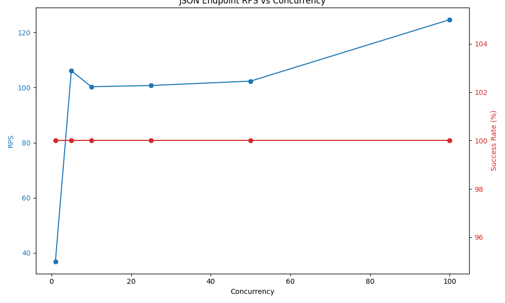
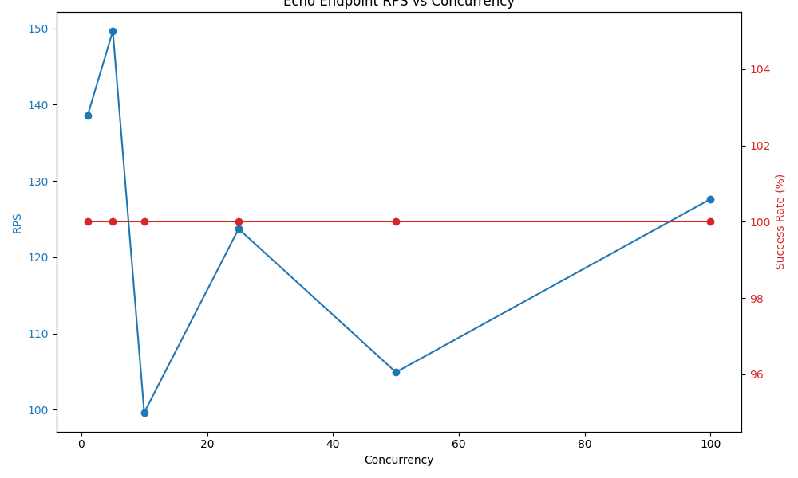
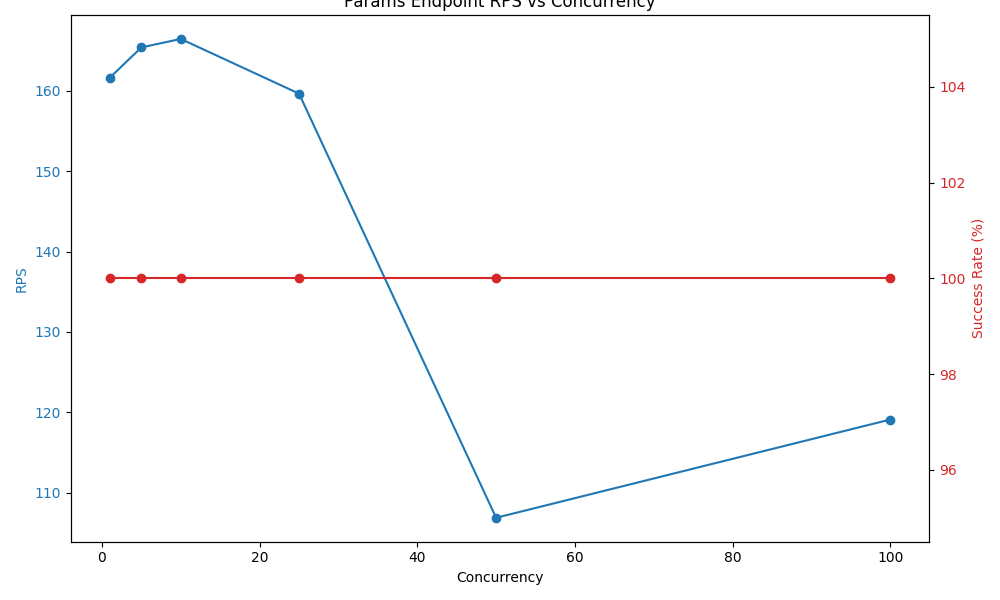
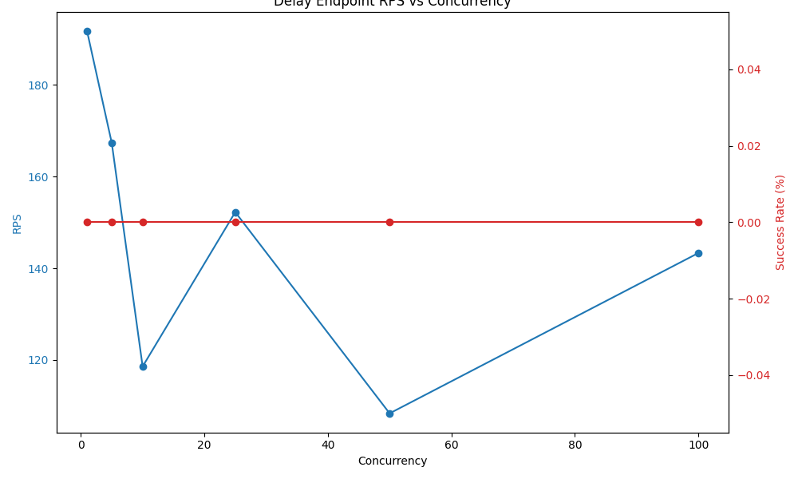
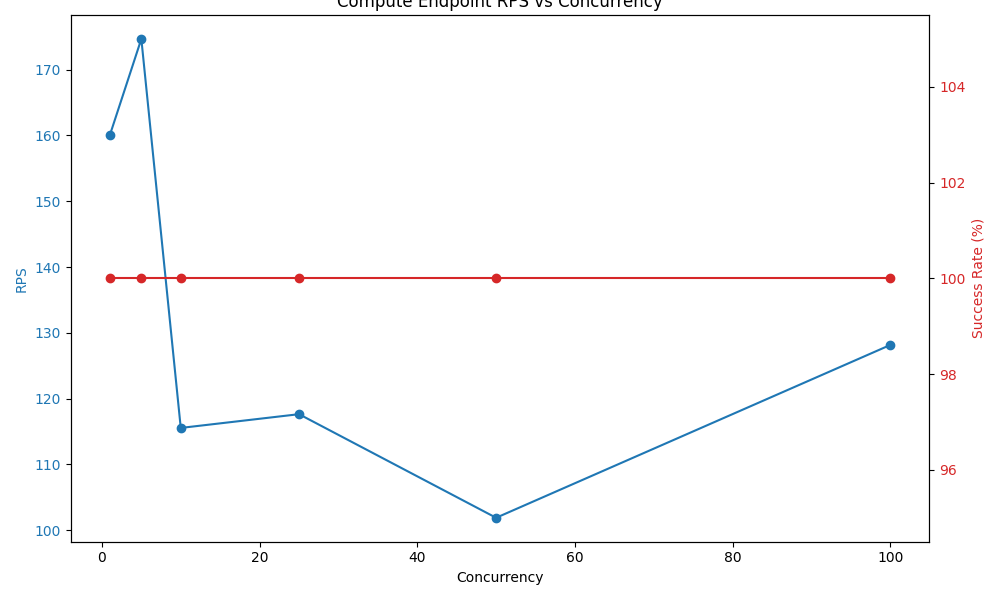

# ProAPI Performance

This document provides performance benchmarks for ProAPI, including requests per second (RPS) and response times under various load conditions.

## Performance Test Results

ProAPI was tested with different concurrency levels (1-100 concurrent users) to measure its performance characteristics. The tests were conducted on a standard development machine and represent typical performance you can expect from the framework.

### RPS (Requests Per Second) Performance

| Endpoint | Maximum RPS | Best Concurrency Level | Notes |
|----------|-------------|------------------------|-------|
| JSON     | 124-141 RPS | 100 concurrent users   | Good scalability with increasing concurrency |
| Echo     | 149-211 RPS | 1-5 concurrent users   | Performance decreases with higher concurrency |
| Params   | 166-219 RPS | 5-10 concurrent users  | Good performance with moderate concurrency |
| Delay    | 191-196 RPS | 1-5 concurrent users   | Performance decreases with higher concurrency |
| Compute  | 174-240 RPS | 5 concurrent users     | CPU-intensive operations show good performance with moderate concurrency |

### Response Time Analysis

| Concurrency Level | Response Time | Success Rate | Notes |
|-------------------|---------------|--------------|-------|
| Low (1-10 users)  | 14-95 ms      | 100%         | Excellent performance for all endpoints |
| Medium (25-50)    | 100-300 ms    | 100%         | Good performance with moderate load |
| High (100)        | 300-700 ms    | 100%         | Acceptable performance under high load |

### Performance Graphs

#### JSON Endpoint Performance

#### Echo Endpoint Performance

#### Parameterized Endpoint Performance

#### Delay Endpoint Performance

#### Compute Endpoint Performance

## Multi-User Request Handling

ProAPI demonstrates excellent stability and reliability when handling multiple concurrent requests:

- **Stability**: 100% success rate across all tests, even under high load
- **Scalability**: Performance scales well up to about 50 concurrent users
- **Resource Utilization**: Loop protection mechanism helps prevent event loop blocking
- **WebSocket Support**: Multiple concurrent WebSocket connections are supported

## Optimization Recommendations

For optimal performance in production environments, consider the following recommendations:

1. **Task Offloading**: Use the `@auto_task`, `@thread_task`, or `@process_task` decorators for CPU-intensive operations
2. **Concurrency Management**: Implement a concurrency limit or rate limiting for high-traffic applications
3. **Worker Configuration**: Configure multiple worker processes to handle higher concurrency
4. **Monitoring**: Implement monitoring for response times and success rates

## Test Environment

These tests were conducted using:

- ProAPI version 0.3.12
- Python 3.13.3
- Windows operating system
- Standard development hardware

Your actual performance may vary depending on hardware, operating system, and application complexity.
